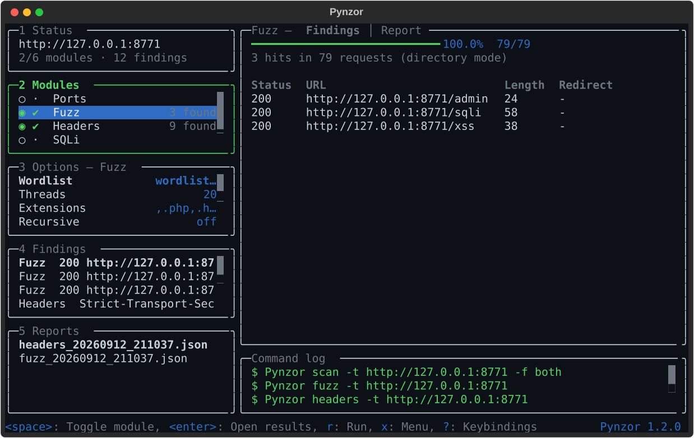

# The Pynzor dashboard

Running `Pynzor` with no arguments in a terminal launches the dashboard. It is
laid out like `lazygit`: a column of side panels you jump to by number, a main
panel that always shows whatever the focused panel is pointing at, a command
log, and a bottom bar listing the keys that work *right here*.

Launch it with a target already filled in:

```bash
Pynzor tui -t https://target.lab
```



## Layout

Five side panels, numbered in their borders, jumped to with `1`-`5` or cycled
with `<tab>`; `l` and `h` move between the column and the main panel. All five
stay open and share the height, as `lazygit` does, so focus moves the border
rather than reflowing the column. The layout also fits 80x24, the smallest
terminal Pynzor targets, where each panel is down to two or three rows and
scrolls.

| # | Panel | The main panel then shows |
| --- | --- | --- |
| 1 | Status | The session: target, selection, findings, equivalent CLI command |
| 2 | Modules | That module's progress, verdict, and findings table |
| 3 | Options | The highlighted option's help, value, and `config.yaml` path |
| 4 | Findings | The highlighted finding, expanded field by field |
| 5 | Reports | The saved report envelope |

Press `?` for the cheatsheet or `x` for a menu of every action available right
now.

## Keys

| Key | Scope | Does |
| --- | --- | --- |
| `1` | Panels | Status panel |
| `2` | Panels | Modules panel |
| `3` | Panels | Options panel |
| `4` | Panels | Findings panel |
| `5` | Panels | Reports panel |
| `<tab>` | Panels | Next panel |
| `<s-tab>` | Panels | Previous panel |
| `l` | Panels | Focus main panel |
| `h` | Panels | Focus side panel |
| `0` | Panels | Main view |
| `j` | Navigation | Down |
| `k` | Navigation | Up |
| `g` | Navigation | Top |
| `G` | Navigation | Bottom |
| `.` | Navigation | Page down |
| `,` | Navigation | Page up |
| `<c-d>` | Navigation | Scroll main down |
| `<c-u>` | Navigation | Scroll main up |
| `<esc>` | Navigation | Back |
| `r` | Run | Run |
| `s` | Run | Stop |
| `e` | Run | Export reports |
| `c` | Run | Copy CLI command |
| `+` | View | Bigger main panel |
| `_` | View | Smaller main panel |
| `@` | View | Command log |
| `/` | View | Filter |
| `x` | App | Menu |
| `?` | App | Keybindings |
| `<c-p>` | App | Command palette |
| `q` | App | Quit |
| `<enter>` | Status | Set target |
| `<space>` | Modules | Toggle module |
| `<enter>` | Modules | Open results |
| `]` | Modules | Next tab |
| `[` | Modules | Previous tab |
| `<enter>` | Options | Edit value |
| `d` | Options | Reset to config default |
| `<enter>` | Findings | Expand |
| `<enter>` | Reports | Open report |
| `d` | Reports | Refresh listing |

<!-- The table above is generated from `pynzor.tui.keymap`; a test asserts the
     two agree, so edit the keymap rather than this table. -->

## Behaviour


- **Live progress** — per-module bars fill as ports, words, and payloads
  complete, and hits stream into the table the moment they are found rather
  than appearing all at once at the end.
- **The main panel follows you** — move the cursor in any side panel and the
  right-hand side re-renders for whatever is under it. `<enter>` pushes focus
  into it for a closer look, `<esc>` comes back, and `<c-d>`/`<c-u>` scroll it
  without giving up your place in the list.
- **Findings in one place** — panel `4` is every finding from the last run,
  flattened across modules, with the full evidence, payload, banner, or
  remediation note the summary table clips.
- **Options are a panel, not a mode** — panel `3` always shows the options for
  the module you are looking at, seeded from your `config.yaml`. `<enter>`
  edits one, `d` puts the default back.
- **It teaches the CLI** — the command log shows the exact `Pynzor <command>`
  each module corresponds to as it runs. `c` copies it, ready for a writeup.
- **Sized for real terminals** — `+`/`_` cycle the main panel between normal,
  half, and full screen; `@` hides the command log; `/` filters a list.

Export (`e`) writes the same `schema_version: 1` JSON the CLI writes, through
the same reporter — dashboard output and `Pynzor <command>` output are
interchangeable.

## Colours

Colours come from your terminal, not from Pynzor: the dashboard draws in the
sixteen ANSI colours and leaves the background alone, so it picks up your theme
and stays translucent if your terminal is. A static image has to commit to one
palette, so the screenshot above is not what the dashboard will look like for
you — it will look like your terminal.

## Regenerating the screenshot

The screenshot is generated, not drawn. `images/make_screenshot.py` runs the
real dashboard against a local HTTP fixture, lets a scan finish, and exports
what Textual rendered:

```bash
uv run python docs/images/make_screenshot.py
```

Regenerate it whenever the layout or palette changes.
